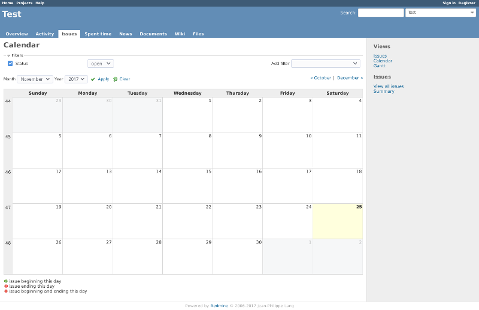
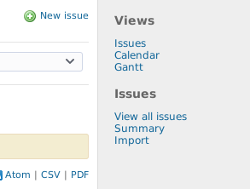

# Redmine Issues Hub

Redmine comes with the separate modules 'Issue Tracking', 'Calendar' and 'Gantt'
which are very similar to each other. You can filter issues or apply custom
queries to them. They even share the same base URL and give you just another
view of the same thing. Your issues...

**So why not have all your issues related views under a single module?**

Redmine Issues Hub removes the modules Calendars and Gantt from the top menu
and adds them as views to the sidebar of the 'Issue Tracking' module.This makes
switching between the views and your custom queries quick and easy. It also
helps new users to understand the purpose and capabilities of the 'Gantt' and
'Calendar' view.

 The plugin fits nicely into Redmines standard layout and reduces the width of
 the top menu, without reducing the functionality.

## Compatiblility
This plugin is compatibe to **all versions** since V0.8.  
There should be no problems with other plugins.

## Settings
After installing the plugin, the menu items 'Calendar' and 'Gantt' are hidden
from the top menu and only accessible via the 'Issues' item. For that reason
the issue tracking module has to be enabled to access the other views.
Redmine's permissions and project settings are not affected by this plugin.

## Navigation

There is the new section 'Views' in the sidebar of the issues view. It shows you
the different views you are permitted to see.

## Install the plugin
Clone the repository or copy the folder 'redmine_issues_hub' to your Redmine's
**plugins** folder and restart your Redmine service. That's it!

No migration needed.

## Uninstall the plugin

Remove the folder 'redmine_issues_hub' from your Redmine's plugins folder and
restart.

## Contribute

Issues Hub needs an additional label for the views header in the sidebar. It's
currently available in English and German. So translations into other
languages are always welcome. Just raise an issue with your translation and I
will integrate it, as quick as possible.
