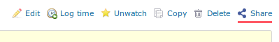

# Redmine Share plugin

This plugin adds a functionality to sharing an issue link.

This plugin works with Redmine 4.0.0 or later.

## Installation

1. Clone or copy files into the Redmine plugins directory
2. Restart Redmine

## License

This plugin is released under the terms of GNU General Public License,
version 2.

## Author

Takeshi Nakamura
